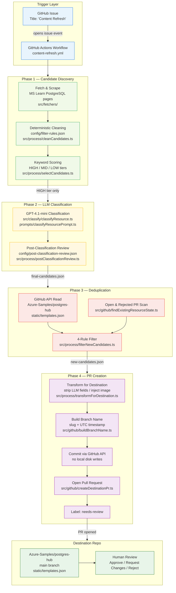
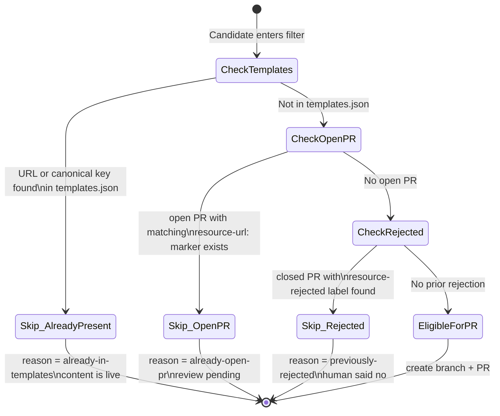
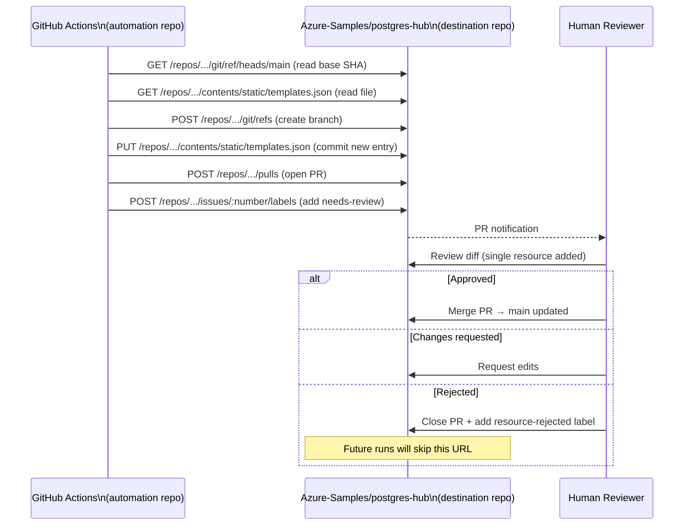

# Content Refresh Automation — Technical Documentation

**Project:** Azure PostgreSQL Hub — Content Refresh Automation Pipeline
**Classification:** Internal Technical Reference
**Version:** 1.0 (MVP)
**Date:** April 2026
**Status:** Feasibility Proof — First End-to-End Run Ready

---

## Table of Contents

1. [Executive Summary](#1-executive-summary)
2. [System Architecture](#2-system-architecture)
3. [Repository Model](#3-repository-model)
4. [Pipeline Stages — Deep Dive](#4-pipeline-stages--deep-dive)
   - 4.1 [Fetch & Scrape](#41-fetch--scrape)
   - 4.2 [Deterministic Cleaning](#42-deterministic-cleaning)
   - 4.3 [Keyword Selection](#43-keyword-selection)
   - 4.4 [LLM Classification](#44-llm-classification)
   - 4.5 [Post-Classification Review](#45-post-classification-review)
   - 4.6 [Candidate Filtering](#46-candidate-filtering)
   - 4.7 [PR Creation](#47-pr-creation)
5. [Data Model](#5-data-model)
6. [Configuration Reference](#6-configuration-reference)
7. [LLM Cost Analysis](#7-llm-cost-analysis)
8. [Security Architecture](#8-security-architecture)
9. [GitHub Actions Workflow](#9-github-actions-workflow)
10. [Idempotency & Safety Guarantees](#10-idempotency--safety-guarantees)
11. [Known Limitations of MVP](#11-known-limitations-of-mvp)
12. [Future Roadmap](#12-future-roadmap)
    - 12.1 [Image Generation via Nano Banana 2](#121-image-generation-via-nano-banana-2)
    - 12.2 [Pipeline Optimizations](#122-pipeline-optimizations)
    - 12.3 [Scale-out & Batching](#123-scale-out--batching)
13. [Appendix — File Inventory](#13-appendix--file-inventory)

---

## 1. Executive Summary

This system automates the discovery and proposal of new developer learning resources for a curated PostgreSQL hub hosted on GitHub. The authoritative content source is Microsoft Learn. The destination is `Azure-Samples/postgres-hub`, a public-facing resource hub for Azure Database for PostgreSQL developers.

**The problem being solved:** The postgres-hub `templates.json` file that drives the content hub requires manual updates as new Microsoft Learn articles are published. Without automation, content becomes stale and relevant new articles are missed.

**The solution:** A GitHub Actions pipeline that runs on demand, crawls Microsoft Learn, evaluates every discovered page through a multi-stage filtering funnel (deterministic rules → LLM classification → duplicate detection), and automatically opens pull requests for content that is genuinely new and relevant. Every PR targets human review before any content reaches the destination.

**MVP scope:** The MVP proves the full pipeline is functional end-to-end at a batch size of one resource per run. It establishes the complete mechanics — fetch, classify, deduplicate, branch, commit, PR — at negligible cost before scaling is enabled.

**Key design principles:**

- No content is ever merged automatically. Every PR requires a human decision.
- No direct push to any `main` branch is possible by design.
- Every run is idempotent. Re-running will not create duplicate branches or PRs.
- LLM cost per full pipeline run is under five US cents.
- The pipeline is triggered by opening a GitHub issue, not by a scheduled cron, so humans control when the automation runs.

---

## 2. System Architecture

### 2.1 High-Level Architecture Diagram



### 2.2 Data Flow Diagram

```mermaid
flowchart LR
    A["MS Learn\nHTML pages"] -->|scraped| B["raw-candidates.json\nCandidateResource[]"]
    B -->|filter-rules.json| C["cleaned-candidates.json"]
    C -->|keyword scoring| D["selected-candidates.json\nHIGH tier"]
    D -->|GPT-4.1-mini| E["classified-valid.json\nClassifiedResource[]"]
    E -->|post-review rules| F["final-candidates.json\n~89 items"]
    F -->|dedup vs destination| G["new-candidates.json\n~62 items"]
    G -->|PR_LIMIT=1| H["1 PR opened\nin postgres-hub"]
```



### 2.3 Deduplication State Machine



### 2.4 Two-Repo Interaction



---

## 3. Repository Model

The system spans two separate GitHub repositories with distinct access scopes.

| Property                  | Automation Repo                              | Destination Repo                             |
| ------------------------- | -------------------------------------------- | -------------------------------------------- |
| **Name**                  | `Emumba-Abdullah/content-refresh-automation` | `Azure-Samples/postgres-hub`                 |
| **Role**                  | Runs the pipeline; never holds final content | Holds the curated resource list              |
| **GitHub Token used**     | `GITHUB_TOKEN` (read-only, built-in)         | `DESTINATION_REPO_TOKEN` (PAT, scoped write) |
| **Direct pushes to main** | Blocked by `permissions: contents: read`     | Blocked by design — pipeline only opens PRs  |
| **Who merges**            | Never merged by automation                   | Human reviewer only                          |

**Why two separate repos?**

Separation prevents the automation from ever accidentally modifying its own workflow files or becoming self-modifying. The `GITHUB_TOKEN` of a GitHub Actions workflow has access to the repository it runs in. By restricting it to `read` and routing all destination writes through a separate named token (`DESTINATION_REPO_TOKEN`), the blast radius of a compromised token or a workflow misconfiguration is contained entirely to the destination repo's PR queue — where a human can review and reject it.

---

## 4. Pipeline Stages — Deep Dive

### 4.1 Fetch & Scrape

**File:** `src/fetchers/`

The scraper fetches HTML from Microsoft Learn's Azure Database for PostgreSQL documentation tree. Each page is parsed with **Cheerio** (a server-side jQuery-compatible HTML parser) to extract:

- `title` — the `<h1>` or `<title>` tag
- `description` — the meta description or first paragraph
- `website` — the canonical URL
- `source` — same as website (preserved as a provenance field for the destination schema)
- `date` — the published or last-updated date if present in the page metadata

**Why Cheerio instead of a headless browser?**

Microsoft Learn returns full HTML on the initial server response (it uses server-side rendering for SEO). Cheerio is ~10× lighter than Playwright or Puppeteer in memory and startup time, requires no Chromium binary, and runs on the GitHub Actions `ubuntu-latest` runner without any additional setup. For content that is fully server-rendered, a headless browser provides no benefit.

**Concurrency control:**

The scraper uses a configurable concurrency window (`CONCURRENCY`, default 5). This prevents rate-limiting by the source server while still being significantly faster than sequential fetching. At a typical MS Learn response time of 300–800 ms, 5 parallel workers produce a full crawl of ~300 pages in under 90 seconds.

**Output:** `output/raw-candidates.json` — array of `CandidateResource` objects.

---

### 4.2 Deterministic Cleaning

**File:** `src/process/cleanCandidates.ts`
**Config:** `config/filter-rules.json`

This stage applies zero-LLM, zero-cost filtering rules that catch obvious junk before any expensive processing occurs. Rules are applied in the following order:

#### Rule execution order

```
1. Empty or broken URL         → DROP  (no protocol, parse failure)
2. dropUrlContains patterns    → DROP  (release notes, troubleshoot pages, etc.)
3. dropTitleContains patterns  → DROP  (delete/reset/stop/troubleshoot operations, etc.)
4. requireNonEmptyDescription  → DROP  (blank description after scrape = no usable content)
```

#### Why these specific title drop rules?

The title blocklist (`delete`, `reset`, `restart`, `start`, `stop`, `error`, `release notes`, `maintenance release`, etc.) targets a well-defined class of MS Learn pages that are operational reference pages, not learning content. A developer hub is for people building applications, not for operators managing server lifecycle. The rule is prefix-only (e.g. "delete" must appear at the start of the title) to avoid false positives on titles like "Understanding how to delete stale embeddings in PostgreSQL."

#### Why URL-path drops at this stage?

Pages like `/release-notes/` and `/troubleshoot/` are identified more reliably by their URL structure than their title (e.g., a troubleshoot page might be titled "Fix connection issues" which sounds useful). URL-pattern matching is O(1) and costs nothing.

**Output:** `output/cleaned-candidates.json`, `output/removed-candidates.json`

---

### 4.3 Keyword Selection

**File:** `src/process/selectCandidates.ts`

This stage assigns a numerical score to each cleaned candidate based on keyword signals in its title and description combined, then buckets the result into three tiers.

#### Scoring algorithm

```
For each candidate:
  title_and_description = title + " " + description (lowercased)

  score = 0
  for signal in HIGH_SIGNALS:   if found → score += 2
  for signal in MID_SIGNALS:    if found → score += 1
  for signal in HARD_DROP:      if found → force tier = LOW, stop scoring

  tier = HIGH  if score >= 4
  tier = MID   if score >= 2
  tier = LOW   if score < 2
```

Only **HIGH** tier candidates proceed to LLM classification. MID tier is preserved in output files for audit but not classified or submitted as PRs.

#### Why a score threshold of 4 for HIGH?

A threshold of 4 requires either two HIGH_SIGNAL matches (+2 each) or one HIGH_SIGNAL plus two MID_SIGNALS. This prevents marginal pages from consuming LLM tokens. In practice, a genuinely useful developer resource (e.g. "Build a RAG application using pgvector and Azure OpenAI") naturally scores 6–10 because it hits multiple AI, vector, and tutorial signals simultaneously. Pages that barely qualify tend to be overview indexes or configuration references that belong in MID or LOW.

#### HARD_DROP_SIGNALS rationale

HARD_DROP targets infrastructure operations that, regardless of how technically precise the article is, do not belong in a developer content hub. Examples include:

- `firewall`, `tls`, `ssl` — network configuration, not app building
- `backup`, `restore`, `point-in-time` — DBA operations
- `high availability`, `failover`, `replica` — infrastructure resilience
- `scale compute`, `scale storage`, `iops` — capacity management
- `private endpoint`, `vnet integration`, `subnet delegation` — networking
- `maintenance window`, `pgaudit`, `audit log` — compliance and operations

These terms have high overlap with real developer concerns in the raw scrape but almost never appear in content that belongs on a developer learning hub. The hard-drop prevents false positives that would waste LLM tokens and human reviewer time.

**Output:** `output/selected-candidates.json`

---

### 4.4 LLM Classification

**Files:** `src/classify/classifyResource.ts`, `prompts/classifyResourcePrompt.ts`
**Model:** GPT-4.1-mini
**Temperature:** 0.1

This is the only stage that uses an external paid API call. Each HIGH-tier candidate is sent individually to GPT-4.1-mini with a structured prompt requesting a JSON response with six fields.

#### Why GPT-4.1-mini?

GPT-4.1-mini was selected over larger models for four reasons:

1. **Cost** — At $0.40/1M input and $1.60/1M output tokens, it is approximately 8× cheaper than GPT-4.1 while producing classification quality that is sufficient for tagging and priority assignment from short structured text (title + description + URL).
2. **Latency** — Average response time is 1–2 seconds per call, making batch classification of 100 resources feasible in under three minutes.
3. **Consistency** — Temperature 0.1 minimises variance. The model is not asked to be creative; it is asked to map a structured input to a bounded vocabulary from a constrained allowed-tags list.
4. **JSON mode** — The system prompt instructs strict JSON output. The code additionally strips markdown code fences that some model versions wrap responses in, providing resilience against minor prompt-following variations.

#### Prompt design decisions

**Explicit allowed-tags list in the prompt:**
The full `config/allowed-tags.json` tag vocabulary is injected into every prompt. This prevents tag hallucination (the model inventing tags that do not exist in the destination schema) and enforces case-sensitivity. Without this constraint, early testing showed the model returning `"PostgreSQL"`, `"postgresql"`, `"genAI"` — none of which match the exact casing required by `templates.json`.

**Learning path contract:**
If the model assigns a learning-path category tag (e.g. `building-genai-apps`), the prompt requires it to also provide `learningPathTitle` and `learningPathDescription`. This is an all-or-nothing contract: the model must either provide both fields or provide neither and not assign the category tag. This prevents partial data entering the destination schema.

**Priority guidance (P0 / P1 / P2):**
The priority system mirrors the destination schema. P0 = highly valuable, broadly useful; P1 = useful but specialized; P2 = valid but lower-value. The LLM uses visible context clues from the title and URL to make this assessment. Priority is used by the destination hub's front-end rendering logic to determine tile prominence.

**Confidence + reasoning fields:**
These are classification metadata fields that are never written to the destination. They serve two functions: (a) an audit trail in `classified-valid.json` so operators can inspect why the model made a classification decision, and (b) a future lever for raising the confidence threshold to filter out uncertain classifications before they reach the PR stage.

#### Output field specifications

| Field                     | Type                   | Constraints                                    | Written to destination? |
| ------------------------- | ---------------------- | ---------------------------------------------- | ----------------------- |
| `tags`                    | `string[]`             | 1–12 items, exact match from allowed-tags.json | Yes                     |
| `priority`                | `"P0" \| "P1" \| "P2"` | Enum                                           | Yes                     |
| `confidence`              | `number`               | 0–1                                            | **No** — audit only     |
| `reasoning`               | `string`               | One sentence                                   | **No** — audit only     |
| `learningPathTitle`       | `string?`              | Required if learning path tag present          | Yes (conditional)       |
| `learningPathDescription` | `string?`              | Required if learning path tag present          | Yes (conditional)       |

**Output:** `output/classified-valid.json`, `output/classified-failed.json`

---

### 4.5 Post-Classification Review

**File:** `src/process/postClassificationReview.ts`
**Config:** `config/post-classification-review.json`

A lightweight deterministic gate that runs after the LLM step to catch pages that were not filtered pre-classification but that the LLM classified anyway. This stage does not use any API calls.

#### Why is this stage needed?

The keyword scoring in Step 3 has a design tension: some pages score HIGH because they mention AI, embedding, or vector terms in a way that is legitimate but still belongs to the wrong domain. For example, `azure.microsoft.com` pages (the Azure portal and marketing site) are not Microsoft Learn documentation and should not appear in a developer learning hub regardless of content quality. Similarly, certain URL patterns that are definitively index pages or pure infrastructure references can appear in the scrape even after the URL filtering in Step 2 because their paths do not always follow predictable patterns.

Running this as a post-LLM step (rather than merging it into Step 2) keeps the filter-rules.json focused on scrape-time signals and the post-classification-review.json focused on classification-time signals. The two configs are intentionally separate to model their different contexts.

**Drop rules in use:**

| Rule type         | Patterns                                                     | Reason                                                        |
| ----------------- | ------------------------------------------------------------ | ------------------------------------------------------------- |
| `dropDomains`     | `azure.microsoft.com`                                        | Non-doc domain: portal/marketing/support, not a Learn article |
| `dropDomains`     | `stackoverflow.com`                                          | Community Q&A, not first-party Microsoft Learn content        |
| `dropUrlContains` | `/sample-scripts-azure-cli`                                  | Generic CLI sample index, not an article                      |
| `dropUrlContains` | `/policy-reference`                                          | Azure Policy landing page, not developer content              |
| `dropUrlContains` | `/scale/how-to-auto-grow-storage`                            | Infra-only: storage autogrow configuration                    |
| `dropUrlContains` | `/configure-maintain/how-to-configure-scheduled-maintenance` | Infra-only: maintenance scheduling                            |

**Result from first full run:** 97 classified → 89 kept, 8 dropped.

**Output:** `output/final-candidates.json`, `output/dropped-after-review.json`

---

### 4.6 Candidate Filtering

**File:** `src/process/filterNewCandidates.ts`
**Dependency:** GitHub API (read-only, destination repo)

This stage is the core deduplication engine. It compares every candidate in `final-candidates.json` against the live state of the destination repository to produce only candidates that are genuinely new and have no prior processing history.

#### The four-check hierarchy

Checks are applied in priority order. The first check that matches determines the skip reason.

**Check 1 — Exact normalized URL match**

Every URL is normalized before comparison:

- Locale prefix stripped: `/en-us/`, `/de-de/`, etc.
- Lowercased
- Trailing slash normalized

The destination `templates.json` is fetched via GitHub API and all `website` field URLs are normalized into a `Set<string>`. An O(1) lookup is performed for every candidate.

**Check 2 — Canonical key match**

This check handles the Microsoft Learn URL restructuring problem. MS Learn has restructured the PostgreSQL documentation tree multiple times, moving articles between subdirectories:

```
Before: learn.microsoft.com/en-us/azure/postgresql/flexible-server/<slug>
After:  learn.microsoft.com/en-us/azure/postgresql/azure-ai/<slug>
After:  learn.microsoft.com/en-us/azure/postgresql/extensions/<slug>
After:  learn.microsoft.com/en-us/azure/postgresql/connectivity/<slug>
```

Without canonical key matching, the same article would appear as "new" every time Microsoft reshuffle their URL structure, leading to duplicate PRs and confusion for reviewers.

**Canonical key derivation logic (`src/utils/canonicalKey.ts`):**

```
Input:  learn.microsoft.com/en-us/azure/postgresql/azure-ai/how-to-use-pgvector
Step 1: Strip locale prefix → /azure/postgresql/azure-ai/how-to-use-pgvector
Step 2: Match pattern /azure/postgresql/<any-subdir>/<slug>
Step 3: Canonical key = "azure/postgresql/how-to-use-pgvector"

Input:  learn.microsoft.com/azure/postgresql/flexible-server/how-to-use-pgvector
Step 1: No locale to strip
Step 2: Match same pattern
Step 3: Canonical key = "azure/postgresql/how-to-use-pgvector"  ← same
```

This ensures that both URLs compare as equivalent regardless of subdirectory changes.

Training path URLs are handled separately:

```
/training/paths/<slug>/...   → canonical: "training/<slug>"
/training/modules/<slug>/... → canonical: "training/<slug>"
```

**Check 3 — Open PR detection**

The GitHub API is queried for all open pull requests in the destination repo. Each PR body is scanned for the machine-readable marker line:

```
resource-url: https://learn.microsoft.com/azure/postgresql/...
```

This marker is inserted by `buildPrBody.ts` into every PR the automation creates. If a PR exists with a matching marker, the candidate is skipped with reason `already-open-pr`.

**Why use a body marker rather than the PR title?**
Branch names and PR titles derived from article slugs are not globally unique enough to use as a lookup key. The `resource-url:` line uses the normalized canonical URL as the identifier, which is stable across renames and edits to the PR title.

**Check 4 — Previously rejected PR detection**

Closed pull requests labeled `resource-rejected` are fetched and scanned with the same `resource-url:` marker logic. If a resource was explicitly rejected by a human reviewer in a previous run, it is permanently skipped in all future runs unless the label is removed.

**The `resource-rejected` label is the only rejection mechanism.** The automation does not infer rejection from anything else (close without merge, comment, etc.). This is intentional: it gives reviewers a single, unambiguous action to permanently suppress a resource.

**Skip summary from first full run:**

| Input → Final candidates       | 89     |
| ------------------------------ | ------ |
| Skipped (already-in-templates) | 27     |
| Skipped (already-open-pr)      | 0      |
| Skipped (previously-rejected)  | 0      |
| **Truly new candidates**       | **62** |

All 27 skips were canonical key matches — the same articles existed in `templates.json` under older URL subdirectory paths.

**Output:** `output/new-candidates.json`, `output/skipped-existing.json`

---

### 4.7 PR Creation

**Files:** `src/github/createDestinationPr.ts`, `src/github/buildBranchName.ts`, `src/github/buildPrBody.ts`, `src/process/transformForDestination.ts`

This stage runs entirely via the GitHub REST API. No local disk writes occur. No local checkout of the destination repository is required in CI.

#### Transformation step

Before any GitHub API call, the `ClassifiedResource` is transformed into a destination-ready `Resource`:

- `confidence` field — **removed**. This is an audit field for the automation pipeline and has no meaning in the destination schema.
- `reasoning` field — **removed**. Same rationale.
- `image` field — **injected** with the value of `PR_IMAGE_PATH` environment variable (default: `./img/placeholder.png`). In the MVP image path is a placeholder; the Nano Banana 2 integration (see Section 12.1) will replace this with a generated image path in a future version.
- All content fields (`title`, `description`, `website`, `source`, `tags`, `priority`, `date`, `tileNumber`, `learningPathTitle`, `learningPathDescription`, `meta`) — preserved as-is.

#### Branch name construction

Branch name format: `content-refresh/<slug>-<YYYYMMDDHHmm>`

Example: `content-refresh/generative-ai-azure-overview-202604131430`

**Why the UTC timestamp suffix?**
A purely slug-based branch name is deterministic and would cause a "Reference already exists" error from the GitHub API if a branch with that name was previously created and then closed/deleted. The timestamp suffix makes every run produce a globally unique branch, eliminating this class of failure entirely. Minutes-precision (not seconds) is used because two pipeline runs within the same minute for the same resource are functionally impossible given the sequential nature of the pipeline and the `PR_LIMIT=1` cap.

**Why UTC specifically?**
GitHub Actions runners use UTC. Using `new Date()` on a runner will always produce a UTC equivalent time. Expressing the timestamp in UTC ensures reproducibility and readability regardless of where the pipeline runs.

#### JSON append strategy (surgical append)

The file contents of `templates.json` are a large JSON array (~88+ entries). A naive `JSON.stringify(entireArray, null, 2)` approach would reformat the entire file on every run, producing a PR diff that shows hundreds of lines changed when only one resource was added. This would make PR review substantially harder.

The `appendToTemplates.ts` module uses a surgical string-based append:

1. Read the raw file content as a string (not parsed)
2. Detect the indentation style by scanning for `\n  {` patterns
3. Serialize only the new resource object to JSON using the canonical key order
4. Find the final `]` character
5. Replace `\n]` with `,\n  {new resource}\n]`
6. Round-trip validate (JSON.parse the result, verify count = countBefore + 1)
7. Preserve the original file's trailing newline

This produces a diff of exactly 16–20 lines for a single new resource addition, regardless of the total file size.

**Note:** The local file append (`appendToTemplates.ts`) is used by development test scripts only. The CI pipeline (`createDestinationPr.ts`) uses the GitHub API's file update mechanism, which receives the full base64-encoded file content. In the CI path, the file is decoded, the resource is appended using the same surgical logic, re-encoded, and committed in a single API call.

#### API call sequence

1. `GET /repos/:owner/:repo/git/ref/heads/main` — fetch current base branch tip SHA
2. `GET /repos/:owner/:repo/contents/static/templates.json?ref=main` — fetch file content + blob SHA
3. Surgically append new resource to decoded content
4. `POST /repos/:owner/:repo/git/refs` — create branch at base SHA
5. `PUT /repos/:owner/:repo/contents/static/templates.json` — commit updated file to branch
6. `POST /repos/:owner/:repo/pulls` — open PR from branch into main
7. `POST /repos/:owner/:repo/issues/:number/labels` — add `needs-review` label

**Why not use the Git Data API (tree/blob/commit objects)?**
The Contents API (`PUT /contents/...`) handles single-file commits in one call and is simpler to reason about for this use case. The low-level Git Data API (create blob → create tree → create commit → update ref) provides more control and is better suited for multi-file commits, but adds four extra API calls and complexity that is not justified for a single-file change.

---

## 5. Data Model

### 5.1 Type Hierarchy

```
CandidateResource           ← raw scrape output
       │
       │ + tags, priority, image (from LLM)
       ▼
ClassifiedResource          ← LLM output (extends Resource)
       │
       │ − confidence, − reasoning, + image path injection
       ▼
Resource                    ← destination-ready (written to templates.json)
```

### 5.2 Type Definitions

```typescript
// Stage 1-2 output: raw scraped page
type CandidateResource = {
  title: string;
  description: string;
  website: string; // source URL (full, with locale)
  source: string; // same as website (provenance field)
  date?: string; // ISO YYYY-MM-DD if available from page
};

// Stage 4 output: LLM-enriched resource (never written to destination)
type ClassifiedResource = Resource & {
  confidence: number; // 0-1 — LLM self-reported certainty
  reasoning: string; // one-sentence audit note
};

// Stage 7 input: destination-ready resource (written to templates.json)
type Resource = {
  title: string;
  description: string;
  website: string;
  source: string;
  image?: string; // relative path: ./img/...
  tags: string[]; // from allowed-tags.json vocabulary
  date?: string; // ISO YYYY-MM-DD
  priority: "P0" | "P1" | "P2";
  tileNumber?: number; // tile position in learning path
  learningPathTitle?: string; // required if learning path tag present
  learningPathDescription?: string; // required if learning path tag present
  meta?: {
    author?: string;
    date?: string;
    duration?: string;
  };
};
```

### 5.3 Key Order in JSON Output

When a new resource is appended to `templates.json`, its keys are written in a canonical order to ensure consistency with the existing entries in the destination repo:

```
title → description → website → source → image →
tags → date → priority → tileNumber →
learningPathTitle → learningPathDescription → meta
```

Absent optional fields are omitted (not written as `null`). This minimises diff noise and matches the style of existing entries.

---

## 6. Configuration Reference

### `config/destination-repo.json`

```json
{
  "owner": "Azure-Samples",
  "repo": "postgres-hub",
  "baseBranch": "main",
  "templatePath": "static/templates.json",
  "rejectedLabel": "resource-rejected",
  "localCheckoutPath": "C:\\Users\\...\\postgres-hub"
}
```

| Field               | Purpose                                             | CI usage                            |
| ------------------- | --------------------------------------------------- | ----------------------------------- |
| `owner` / `repo`    | Destination GitHub repository coordinates           | Used in every API call              |
| `baseBranch`        | Branch all PRs target                               | Used in branch creation and PR base |
| `templatePath`      | Path to resource list within destination repo       | Used in file read/write API calls   |
| `rejectedLabel`     | Label that permanently blacklists a resource URL    | Used in rejected-PR scan query      |
| `localCheckoutPath` | Absolute path to local checkout of destination repo | **Dev-only** — not used in CI       |

### `config/allowed-tags.json`

Vocabulary of 43 valid tag strings. The LLM is given this full list in every prompt and is strictly forbidden from using any tag outside it. This field is case-sensitive at the destination level.

Tags cover six categories:

- **Content type:** `documentation`, `tutorial`, `workshop`, `video`, `blog`, `how-to`, `concepts`
- **Technology:** `python`, `javascript`, `java`, `dotnet`, `go`, `php`
- **AI/ML:** `genai`, `rag`, `vector-search`, `azure-ai-extension`, `semantic-search`, `agents`
- **Learning paths:** `developing-core-applications`, `building-genai-apps`, `building-ai-agents`
- **Hub meta:** `featured`, `overview`, `fundamentals`
- **Integrations:** `microsoft-fabric`, `powerbi`, `azure-data-factory-(adf)`, `devops`

### `config/filter-rules.json`

Pre-classification deterministic drop rules.

| Rule                         | Entries     | Purpose                                                |
| ---------------------------- | ----------- | ------------------------------------------------------ |
| `dropTitleContains`          | 22 patterns | Operational titles (delete, reset, troubleshoot, etc.) |
| `dropUrlContains`            | 4 patterns  | Release notes, troubleshoot paths, broken double-slash |
| `requireNonEmptyDescription` | `true`      | Drop pages where scrape returned no description text   |

### `config/post-classification-review.json`

Post-LLM deterministic drop rules.

| Rule              | Entries    | Purpose                                             |
| ----------------- | ---------- | --------------------------------------------------- |
| `dropDomains`     | 2 domains  | `azure.microsoft.com`, `stackoverflow.com`          |
| `dropUrlContains` | 4 patterns | CLI sample index, Policy reference, infra/ops paths |

### `config/settings.json`

```json
{
  "minTags": 1,
  "maxTags": 12,
  "oneResourcePerPR": true,
  "imageGenerationEnabled": false
}
```

`imageGenerationEnabled: false` is the feature flag for Nano Banana 2 integration (see Section 12.1). When set to `true` in a future release, the pipeline will call the image generation service and set the resulting image path on each resource instead of using the placeholder.

### `config/learning-paths.json`

Defines the three learning path category identifiers used in the LLM prompt:

```json
{
  "categories": [
    "developing-core-applications",
    "building-genai-apps",
    "building-ai-agents"
  ]
}
```

These are the only tags that trigger the learning-path contract (requiring `learningPathTitle` and `learningPathDescription` in the LLM response).

---

## 7. LLM Cost Analysis

### 7.1 Token Budget Per Classification Call

Each call to GPT-4.1-mini consists of a system message and a user message containing the classification prompt.

**Input token breakdown (approximate per resource):**

| Component                             | Tokens (est.)   |
| ------------------------------------- | --------------- |
| System message ("strict JSON engine") | ~15             |
| Prompt preamble and instructions      | ~180            |
| Resource title + description + URL    | ~80             |
| Allowed tags list (43 tags)           | ~120            |
| Learning path categories              | ~20             |
| Output format specification           | ~80             |
| **Total input per call**              | **~495 tokens** |

**Output token breakdown (approximate per resource):**

| Component                   | Tokens (est.)   |
| --------------------------- | --------------- |
| JSON object with 4–6 fields | ~80             |
| Tags array (avg 4 tags)     | ~25             |
| Reasoning sentence          | ~20             |
| **Total output per call**   | **~125 tokens** |

### 7.2 Pricing Model (GPT-4.1-mini, April 2026)

| Token type | Rate              |
| ---------- | ----------------- |
| Input      | $0.40 / 1M tokens |
| Output     | $1.60 / 1M tokens |

### 7.3 Cost per Pipeline Run

| Scenario                       | Resources classified | Input tokens | Output tokens | Estimated cost |
| ------------------------------ | -------------------- | ------------ | ------------- | -------------- |
| MVP (first run)                | 20                   | 9,900        | 2,500         | **$0.008**     |
| Full run (97 HIGH-tier)        | 97                   | 48,015       | 12,125        | **$0.038**     |
| Aggressive run (200 resources) | 200                  | 99,000       | 25,000        | **$0.080**     |
| Monthly (4 runs × 97)          | 388                  | 192,060      | 48,500        | **$0.154**     |

### 7.4 Cost Optimizations Available

**Prompt caching:**
OpenAI's prompt caching feature (available for prompts over 1,024 tokens) would apply to the static portion of the prompt (instructions + allowed tags list ≈ ~400 tokens). At a 50% cache discount on input tokens, cache hits would reduce per-call input cost to ~$0.10/1M for cached tokens.

**Batching:**
The OpenAI Batch API offers a 50% discount on both input and output tokens at the cost of up to 24-hour turnaround. Given that this pipeline is not time-sensitive (runs are triggered manually), migrating to the Batch API could halve LLM cost, reducing a full 97-resource run to approximately **$0.019**.

**Tiered classification:**
Currently only HIGH-tier candidates are classified. MID-tier candidates (score 2–3) are left unclassified. A future optimization could classify MID-tier candidates at a higher temperature or with a simpler prompt specifically for borderline cases.

**Cost conclusion:** LLM cost is not a meaningful constraint for this project at any planned scale. The entire year's pipeline operation at weekly intervals with 97 resources classified per run would cost approximately $2.00 in LLM API fees.

---

## 8. Security Architecture

### 8.1 Token Isolation

Two distinct GitHub tokens are used with the minimum required scopes:

| Token                     | Scope                                                                     | What it can do                                               |
| ------------------------- | ------------------------------------------------------------------------- | ------------------------------------------------------------ |
| `GITHUB_TOKEN` (built-in) | `contents: read`, `issues: read`                                          | Read this automation repo only. Cannot write anywhere.       |
| `DESTINATION_REPO_TOKEN`  | `contents: write`, `pull_requests: write` on `Azure-Samples/postgres-hub` | Create branches, commit files, open PRs in destination only. |

The built-in `GITHUB_TOKEN`'s default write permissions are explicitly overridden in the workflow:

```yaml
permissions:
  contents: read
  issues: read
```

This prevents a class of exploits where a malicious PR to the automation repo could trigger a workflow that writes back to the automation repo itself (e.g., modifying workflow files to exfiltrate secrets).

### 8.2 No Direct Push Guarantee

The pipeline has no code path that calls `git push`. All destination writes go through the GitHub API using `PUT /contents/...` which creates a commit on a non-main branch. The `main` branch of the destination repo is never the target of any write operation — it is only read to get the base SHA. All changes must arrive via PR and require explicit human approval.

### 8.3 Injection Risks

The system handles user-supplied data (scraped HTML from external websites) and passes portions of it (title, description, URL) to OpenAI's API. This presents two considerations:

1. **Prompt injection from scraped content:** A malicious MS Learn page (or a search result that resolves to non-MS-Learn content) could contain text designed to manipulate the LLM's output. Mitigations: (a) the scraper is scoped to `learn.microsoft.com` URLs only; (b) the classification prompt uses a strict JSON-only system instruction; (c) the output is parsed as JSON and validated against a schema — any attempt to inject instructions would be caught as a JSON parse error.

2. **XSS / content injection in PR body:** The PR body is built from structured fields (title, description, URL) using string template literals. No raw HTML is injected. The `resource-url:` line is written from the normalized URL which is validated to start with `https://`.

### 8.4 Secret Handling

- Secrets are accessed via `process.env` only — never hardcoded.
- Secrets are not echoed to console output in any code path.
- The `.env` file is not committed (enforced by `.gitignore`).
- In GitHub Actions, secrets are automatically redacted in logs by the runner.

---

## 9. GitHub Actions Workflow

**File:** `.github/workflows/content-refresh.yml`

### 9.1 Trigger

```yaml
on:
  issues:
    types: [opened]

jobs:
  run-content-refresh:
    if: github.event.issue.title == 'Content Refresh'
```

The workflow only runs when an issue is opened with the exact title `"Content Refresh"`. Any other issue title is ignored. This is an intentional human-in-the-loop gate: the pipeline cannot run by itself without someone opening the trigger issue.

**Why issues rather than `workflow_dispatch` or `schedule`?**
Issues provide a natural audit log (every issue has a timestamp, an opener identity, and a URL) at zero additional cost. They also make it trivial for a non-engineer to trigger a run without needing access to the GitHub Actions UI. A `schedule` trigger was rejected because it removes human control over when the pipeline consumes API credits and creates PRs.

### 9.2 Permissions

```yaml
permissions:
  contents: read
  issues: read
```

The `pull-requests: none` default means the automation repo's workflow cannot open, close, or comment on its own PRs. This is the minimal viable permission set.

### 9.3 Environment Variables

```yaml
env:
  LLM_API_KEY: ${{ secrets.LLM_API_KEY }}
  DESTINATION_REPO_TOKEN: ${{ secrets.DESTINATION_REPO_TOKEN }}
  PR_LIMIT: "1"
```

`PR_LIMIT: "1"` is hardcoded in the workflow for the MVP phase. It will be changed to a higher value (or made configurable via the issue body) in a subsequent release.

### 9.4 Step Sequence

| Step            | Command                                         | Fail behaviour                                 |
| --------------- | ----------------------------------------------- | ---------------------------------------------- |
| Checkout        | `actions/checkout@v4`                           | Abort                                          |
| Node setup      | `actions/setup-node@v4` with `node-version: 20` | Abort                                          |
| Install deps    | `npm ci`                                        | Abort                                          |
| Fetch and clean | `runCleanCandidatesTest.ts`                     | Abort                                          |
| Select          | `runSelectionTest.ts`                           | Abort                                          |
| Classify        | `runBatchClassificationTest.ts 20`              | Abort                                          |
| Post-review     | `runPostClassificationReview.ts`                | Abort                                          |
| Filter + PR     | `runPipeline.ts`                                | Abort (non-zero exit if any PR creation fails) |
| Print summary   | `cat output/pr-creation-results.json`           | **Always runs** (`if: always()`)               |

The summary step runs unconditionally so that failure diagnostics are always available in the Actions log even when an earlier step aborts the job.

---

## 10. Idempotency & Safety Guarantees

The system is designed to be safe to run multiple times without producing unintended duplicates or side effects.

| Scenario                                                | Expected behaviour                                                                                                                         |
| ------------------------------------------------------- | ------------------------------------------------------------------------------------------------------------------------------------------ |
| Run twice in a row, no new content                      | Second run: 0 new candidates identified, 0 PRs created                                                                                     |
| Run after a PR is merged                                | Merged resource is now in `templates.json`; future runs skip it as `already-in-templates`                                                  |
| Run after a PR is closed without merge (no label)       | Resource is **not** tracked as rejected; it will appear again as a new candidate in future runs                                            |
| Run after a PR is closed with `resource-rejected` label | Resource is permanently skipped in all future runs                                                                                         |
| Branch name collision                                   | Impossible: every branch includes a UTC timestamp suffix ensuring global uniqueness                                                        |
| `templates.json` is not valid JSON at the destination   | `createDestinationPr.ts` will throw before any write occurs; PR is not created                                                             |
| Network failure mid-API-call sequence                   | Branch may be created without a PR; the next run will create a new branch with a new timestamp and a new PR; the orphan branch is harmless |

---

## 11. Known Limitations of MVP

The MVP deliberately trades completeness for correctness. The following limitations are known and accepted for the first end-to-end run:

| Limitation                                            | Impact                                                           | Planned resolution                                                 |
| ----------------------------------------------------- | ---------------------------------------------------------------- | ------------------------------------------------------------------ |
| `PR_LIMIT=1` — one resource per pipeline run          | Low throughput; 62 new candidates would require 62 separate runs | Increase limit once pipeline is validated (see Section 12.3)       |
| Image path is a placeholder (`./img/placeholder.png`) | PRs require manual image assignment after merge                  | Nano Banana 2 integration (Section 12.1)                           |
| No automatic recovery from mid-sequence API failures  | Orphan branches possible after network errors                    | Retry logic + cleanup (Section 12.2)                               |
| MID-tier candidates (score 2–3) are never classified  | Borderline-relevant content is not proposed                      | Classify MID tier with a lower-confidence threshold (Section 12.2) |
| Classification batch size capped at 20 in workflow    | Full HIGH-tier batch (97 items) not classified per run           | Increase cap incrementally as pipeline proves stable               |
| No notification on PR creation                        | Reviewer must check GitHub manually                              | GitHub notification settings + Slack/Teams webhook                 |
| ~~`leaning-paths.json` filename typo~~                | Fixed — renamed to `learning-paths.json`                         | Done                                                               |

---

## 12. Future Roadmap

### 12.1 Image Generation via Nano Banana 2

**Current state:** The `image` field in each new resource is set to `./img/placeholder.png`. This is a functional placeholder that satisfies the `templates.json` schema but does not provide a real tile image for the destination hub.

**Planned integration:** Nano Banana 2 is a text-to-image generation service that will produce themed tile images matching the visual style of the postgres-hub. The integration will be gated by the `imageGenerationEnabled` flag in `config/settings.json`.

**Proposed integration point:**

```
transformForDestination.ts
       │
       ▼
  if (settings.imageGenerationEnabled)
       │
       ├── call Nano Banana 2 API
       │   input: title + description + primary tag
       │   output: image URL or base64
       │
       ├── download/store image to ./img/<slug>.png
       │       (or upload directly to destination repo assets branch)
       │
       └── set resource.image = "./img/<slug>.png"
  else
       └── resource.image = PR_IMAGE_PATH (placeholder)
```

**Design considerations for Nano Banana 2 integration:**

1. **Image storage location:** Generated images must be committed to the destination repo alongside the `templates.json` update. This means extending `createDestinationPr.ts` to include a second file commit (the image) in the same branch before opening the PR. The Git Data API (blob upload → tree update → commit) will be needed for multi-file commits.

2. **Generation parameters:** The image prompt should be derived from a combination of the resource title, primary tag, and a fixed style prefix consistent with the postgres-hub visual brand. A style template should be maintained in config.

3. **Cost implications:** Image generation adds per-resource cost. Nano Banana 2 pricing will need to be factored into the pipeline cost model.

4. **Fallback:** If the image generation call fails, the pipeline should fall back to the placeholder rather than aborting PR creation. Image quality is not a correctness concern.

---

### 12.2 Pipeline Optimizations

**A. Retry logic for GitHub API calls**

Currently, a transient network error during any of the 7 API calls in `createDestinationPr.ts` will abort the entire PR creation for that resource. The branch may already be created at the point of failure, leaving an orphan.

Recommended fix: wrap each API call in an exponential-backoff retry with a maximum of 3 attempts and a jitter factor. The GitHub API occasionally returns `502` or `503` during high-load periods and these errors are typically transient.

**B. Prompt caching**

The static section of the classification prompt (instructions + allowed-tags list + output format specification) accounts for ~400 of the ~495 input tokens per call. OpenAI's prompt caching automatically applies a 50% discount to cached prefix tokens for prompts exceeding 1,024 tokens.

To qualify, the system message and the static portion of the user message should be moved to the beginning of the prompt and separated from the per-resource variable content (title, description, URL) which appears at the end. This maximises the cacheable prefix length.

**C. Confidence threshold gate**

The `ClassifiedResource.confidence` field is currently stored in the output files but is not used for any filtering decision. A confidence threshold (e.g. `confidence >= 0.7`) could be added as a gate before the post-classification review step. Resources where the LLM is uncertain about classification quality would be written to a `output/low-confidence.json` file for human review rather than proceeding to PR creation.

**D. Incremental scraping**

Currently, the full MS Learn PostgreSQL documentation tree is scraped on every run. An incremental approach — storing the last-seen `Last-Modified` header or a hash of page content for each URL and re-scraping only changed pages — would significantly reduce scrape time and server load on repeat runs.

**E. MID-tier classification**

MID-tier candidates (keyword score 2–3) are currently never classified. Some of these are genuinely useful articles that score in the mid-range only because they are narrower in scope. A secondary classification pass at a lower confidence threshold, or with a simplified one-shot prompt, could surface additional valid content that the HIGH-tier filter misses.

---

### 12.3 Scale-out & Batching

The MVP is capped at `PR_LIMIT=1`. The following incremental scaling path is recommended:

| Phase         | PR_LIMIT | Classification batch | Estimated PRs per run                                   | Estimated cost |
| ------------- | -------- | -------------------- | ------------------------------------------------------- | -------------- |
| MVP (current) | 1        | 20                   | 1                                                       | $0.008         |
| Phase 2       | 5        | 50                   | 5                                                       | $0.020         |
| Phase 3       | 20       | 97                   | 16 (est. new per run)                                   | $0.038         |
| Steady state  | 10/week  | 97                   | ~10 (new content rate limited by MS Learn publish rate) | $0.038         |

At steady state, the expected rate of genuinely new MS Learn PostgreSQL articles is approximately 3–10 per week. At `PR_LIMIT=10`, the pipeline would process all new content in a single weekly run.

**Batching with the OpenAI Batch API:**
For Phase 3 and beyond, migrating classification to the OpenAI Batch API (50% cost reduction, up to 24-hour turnaround) is recommended. The pipeline would submit a classification batch, poll for completion, and process results in a second pipeline run the following day.

---

## 13. Appendix — File Inventory

```
content-refresh-automation/
│
├── .github/
│   ├── ISSUE_TEMPLATE/
│   │   └── content-refresh.yml        Issue template (pre-fills title "Content Refresh")
│   └── workflows/
│       └── content-refresh.yml        Main CI/CD workflow
│
├── config/
│   ├── allowed-tags.json              43 valid tag strings for LLM vocabulary constraint
│   ├── destination-repo.json          Destination repo coordinates + config
│   ├── filter-rules.json              Pre-classification deterministic drop rules
│   ├── learning-paths.json            Learning path category identifiers
│   ├── post-classification-review.json Post-LLM domain + URL-pattern drop rules
│   └── settings.json                  Global pipeline flags (minTags, maxTags, PR per resource, image gen)
│
├── prompts/
│   └── classifyResourcePrompt.ts      LLM prompt builder — injected with allowed tags + resource fields
│
├── src/
│   ├── classify/
│   │   └── classifyResource.ts        GPT-4.1-mini API call — returns ClassifiedResource
│   │
│   ├── fetchers/
│   │   └── (scraper modules)          HTTP fetch + Cheerio HTML parse → CandidateResource
│   │
│   ├── github/
│   │   ├── buildBranchName.ts         slug + YYYYMMDDHHmm UTC → unique branch name string
│   │   ├── buildPrBody.ts             Markdown PR body builder — includes mandatory resource-url: marker
│   │   ├── createDestinationPr.ts     Full remote PR flow — 7 sequential GitHub API calls
│   │   ├── findExistingResourceState.ts  Scans open PRs + closed rejected PRs for resource-url: markers
│   │   └── loadDestinationTemplates.ts   Fetches templates.json from destination — returns URL + canonical Sets
│   │
│   ├── pipeline/
│   │   └── runPipeline.ts             End-to-end runner: filter → transform → PR, with PR_LIMIT cap
│   │
│   ├── process/
│   │   ├── appendToTemplates.ts       Surgical local file append — dev testing only, not used in CI
│   │   ├── appendTransformedCandidate.ts  transform + local append — dev testing only
│   │   ├── cleanCandidates.ts         Applies filter-rules.json deterministic drop rules
│   │   ├── filterNewCandidates.ts     4-check deduplication: templates → open PR → rejected PR
│   │   ├── postClassificationReview.ts   Applies post-classification-review.json rules
│   │   ├── selectCandidates.ts        Keyword score → HIGH/MID/LOW tier assignment
│   │   └── transformForDestination.ts    Strip LLM audit fields, inject image path → destination Resource
│   │
│   ├── test/
│   │   ├── runCleanCandidatesTest.ts  Step 1-2: fetch + clean
│   │   ├── runSelectionTest.ts        Step 3: keyword scoring
│   │   ├── runBatchClassificationTest.ts  Step 4: LLM classify (takes count arg)
│   │   ├── runPostClassificationReview.ts  Step 5: post-LLM review
│   │   ├── runFilterNewCandidatesTest.ts   Step 6: deduplication + output new-candidates.json
│   │   ├── runCreateDestinationPrTest.ts   Step 7: single PR creation (takes index + image args)
│   │   ├── runTransformForDestinationTest.ts  Dev: show transform input/output side-by-side
│   │   ├── runAppendToTemplatesTest.ts    Dev: local append test (requires localCheckoutPath)
│   │   ├── runAppendTransformedCandidateTest.ts  Dev: transform + local append
│   │   ├── runFetchTest.ts            Dev: scrape only, no cleaning
│   │   ├── runClassificationTest.ts   Dev: single resource classification
│   │   └── runValidationTest.ts       Dev: schema validation check
│   │
│   ├── types/
│   │   └── resource.ts                CandidateResource, Resource, ClassifiedResource type definitions
│   │
│   └── utils/
│       ├── canonicalKey.ts            URL → stable identity key (subdirectory-agnostic matching)
│       ├── learningPath.ts            Learning path utility helpers
│       ├── normalizeUrl.ts            Strip locale prefix, lowercase, trailing slash normalize
│       └── resourceValidator.ts       Required field validation for Resource objects
│
├── output/                            Runtime-generated, gitignored
│   ├── raw-candidates.json            Post-scrape, pre-cleaning
│   ├── cleaned-candidates.json        Post-filter-rules
│   ├── removed-candidates.json        Items dropped by filter-rules with reasons
│   ├── selected-candidates.json       Post-keyword-scoring with tier assignments
│   ├── classified-valid.json          LLM-classified resources with confidence + reasoning
│   ├── classified-failed.json         LLM calls that failed or returned invalid JSON
│   ├── dropped-after-review.json      Items dropped by post-classification-review.json rules
│   ├── final-candidates.json          Final LLM output after all pre-PR filters
│   ├── new-candidates.json            Candidates that passed deduplication (truly new)
│   ├── skipped-existing.json          Candidates that were skipped with reason + matchedKey
│   └── pr-creation-results.json       Per-resource PR creation status (created/failed + PR URL)
│
├── .env                               Local secrets — never committed
├── package.json                       Node.js project manifest + dependencies
├── tsconfig.json                      TypeScript compiler configuration
└── README.md                          Operational quick-start guide
```

---

_End of Technical Documentation_
